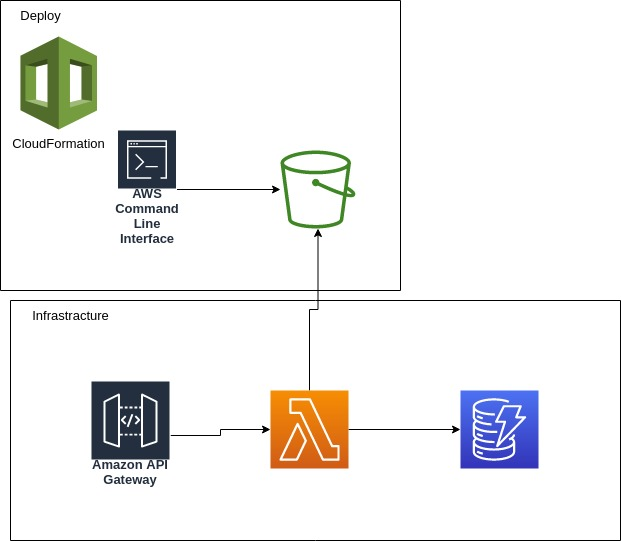

# Deploy lambda functions

This repository aim to depict some of the different ways to deploy a bunch of lambda functions behind an **Api Gateway**.

In general we will use:

 * *CloudFormation*: to replace the tons of clicks and surfing on the AWS Console required for defining a replicable infrastracture we define a *template* of AWS resources;
 * *Bash scripting*: to automate some AWS Cli commands or bash scripts;
 * *Python*: as the first language choice for api code implementation and other scripts.

## How to execute the scripts (Under *UNIX system)

Mandatory to replicate the working stacks is:

 1. execute `python -m venv venv` to create the virtual environment. Then load the environment with `source venv/bin/activate`
 2. execute `aws configure` with credentials of a user with enough roles to deploy the stack, we require full access on cloudfront, s3, role management...
 3. You've finish the setup!


The steps to reproduce the working stack depends of which method we implement, so jump to one implementation!

## What you will see

Each folder `/01_xxxxx` consists of:

 * `template.yml`: the template of the CloudFormation stack;
 * `00_config`: the env variable that need to be configured for deploy correctly your api;
 * `0*_*.sh` the shell script to have been execute in correct order;
 * `lambda_function.py`: the only one file containing the api code.

## The PoC (the app)

We are building the infrastracture and api for a Todo App! All documents are entities named *Note* with fields *uuid, description*. We plan to do nothing more than a CRUD operations:

* GET `note/` to list all notes;
* POST `note/` to create a note;
* GET `note/{note-id}` to get single note;
* DELETE `note/{note-id}` to delete the note;
* PUT `note/{note-id}` to update a note;

So ideally when a deploy is finished we should run:

```
cloudformation describe-stacks --stack-name ${STACK_NAME}
```
to pull some data and also the endpoint of our deployed, staged and running stack:

```
......
"Outputs": [
                {
                    "OutputKey": "Endpoint",
                    "OutputValue": "https://YOUR_STACK_ID.execute-api.YOUR_REGION.amazonaws.com/prod/api/note/"
                }
.....
```

Now we can interact with our api with one of our favorite tool (for us curl):

```
>>> curl -X GET https://YOUR_STACK_ID.execute-api.YOUR_REGION.amazonaws.com/prod/api/note/
[]

>>> curl -X POST -H "Content-Type: application/json" -d '{"description":"Ciao mondo"}' https://YOUR_STACK_ID.execute-api.YOUR_REGION.amazonaws.com/prod/api/note/
{"uuid": "15bfe7e0-818a-435a-bc73-541f9670aa98", "description": "Ciao mondo"}

>>> curl -X PUT -H "Content-Type: application/json" -d '{"description":"Ciao mondo modified"}' https://YOUR_STACK_ID.execute-api.YOUR_REGION.amazonaws.com/prod/api/note/15bfe7e0-818a-435a-bc73-541f9670aa98
{"description": "Ciao mondo modified", "uuid": "15bfe7e0-818a-435a-bc73-541f9670aa98"}

>>> curl -X GET https://4v2myw6jg6.execute-api.eu-central-1.amazonaws.com/prod/api/note/
[
    {
        "description": "Ciao mondo modified",
        "uuid": "15bfe7e0-818a-435a-bc73-541f9670aa98"
        }
]
```


## The 'thousand' ways

1. `01_manual_provision/`: (zip code) Manual provision the bucket containing the functions and link togheter to a second template;
2. ~~`02_inline_function/`: (inline code) bounded by the limit of template dimension one person can use [inline function][https://docs.aws.amazon.com/AWSCloudFormation/latest/UserGuide/aws-properties-lambda-function-code.html]~~;
3. ~~`03_template_provisioning/`: (zip code) leveredge of the command [aws cloudformation package][https://docs.aws.amazon.com/AWSCloudFormation/latest/UserGuide/using-cfn-cli-package.html]~~;
4. ~~`04_deploy_by_container`: (container code) publish the code by creating an [ECR container][https://docs.aws.amazon.com/AmazonECR/latest/userguide/what-is-ecr.html]~~;
5. ~~`05_sam_provisioning`: [another cli tool][https://aws.amazon.com/serverless/sam/]~~;
6. ~~`06_amplify`: [framework Amplify][https://docs.amplify.aws/]~~


# Usefull resource

- Template validator `cfn-lint` (Python library). Really the `aws cloudformation --validate-stack` is not enough. Use this simple tool for inspect syntax and semantic problems, it's worth it.
- Template generator from current resource deployed [Former2][https://former2.com/#section-outputs-cloudformation] while testing a solution on the AWS Console is very straightforward decode your solution in YML or JSON file isn't easy. Former2 helps you to select what resource you want and generate a """working""" YML.

# `/01_manual_provision`

There are two possibilities to deploy a lambda function: with a custom container image or a S3. 



The plan:
1. Build a zip file
2. upload the zip file onto a bucket
3. link the position of this file and build a template.yml
4. deploy the stack

Cons:
- Managing the zip file
- While deprovision all resource of a stack is made monolitich by CloudFormation, deleting the source code and delete the bucket is done by hand...so another piece of code to mantain
